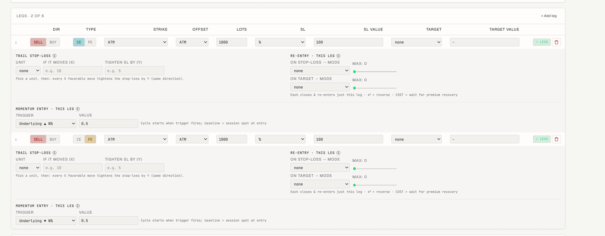

i want to implement new momemtum based stategy on BTC options Strategy is basically short straddle. 
1. Entry time is 16:00 IST  and exit time is 17:30 IST(let the option expires itself.) 
2. entry condition is if BTC moved 0.5% in any direction, then we take entry in CE and PE
3. Stoploss is 100% of the premium collected.
4. Sell ATM contracts

you can refer the attached image for same rules

